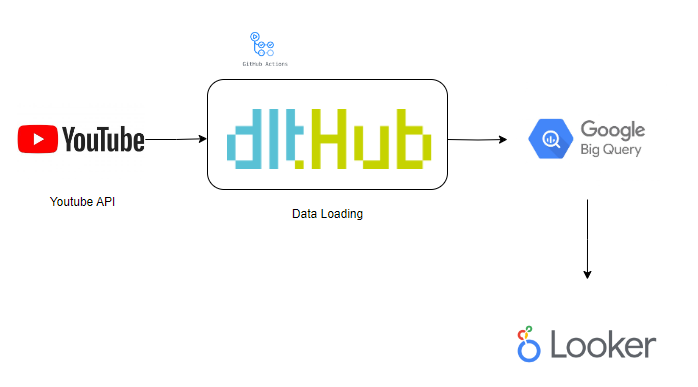

# YouTube Comments Pipeline

This project is a data pipeline that fetches comments from a specific YouTube video and stores them in a BigQuery table. The pipeline is implemented in Python and uses the YouTube Data API v3 to fetch the comments and the `dlt` library to manage the data pipeline.





## Setup

1. Install the required Python packages:

```bash
pip install -r requirements.txt
```

2. Set up the following environment variables:

API_KEY: Your YouTube Data API v3 key.

3. Set up Google Cloud authentication as described in the Google Cloud documentation.

Usage
Run the pipeline with the following command:
```bash
python dlt_pipeline.py
```

This will fetch the comments from the YouTube video specified by VIDEO_ID in dlt_pipeline.py, and store them in the youtube_comments_table table in the youtube_comments_data dataset in BigQuery.


Data

The pipeline fetches the following data for each comment:

- author: The display name of the author of the comment.
- text: The text of the comment.
- like_count: The number of likes the comment has received.
- total_reply_count: The total number of replies to the comment.
- video_id: The ID of the video the comment was posted on.
- published_date: The date and time the comment was published.

Contributing
Contributions are welcome! Please read the contributing guidelines before getting started.